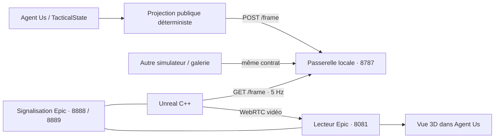

# Maritime Sim — module Unreal indépendant

Ce répertoire peut être copié hors d’Agent Us. Il contient un projet **Unreal Engine 5.8 C++**, une passerelle HTTP Node 24, un lecteur Pixel Streaming et un contrat de scène Zod versionné. Le moteur est un **visualiseur**, pas une deuxième simulation : il n’avance jamais les mobiles ni les tours.

**État : intégration fonctionnelle et révision visuelle 4.** Le lancement de la vue 3D depuis Agent Us a été testé avec succès par l'utilisateur sous Windows. La [révision 4](catalog/VISUAL_V4.md) corrige le traitement des ombres et de l'exposition, ajoute Nanite, des textures de revêtement et une réponse amortie des coques à la houle. Les neuf modèles principaux restent des reconstructions extérieures à partir d'images publiques ; les concepts futurs sont identifiés comme tels. Les assets et exécutables générés restent locaux. La fidélité photographique de tous les détails reste à affiner.

**Installation existante :** fermer le module, lancer `update-visuals.ps1`, puis `build.ps1 -Package` avec le même `-EngineRoot`. Aucune nouvelle extension Unreal n'est nécessaire. Voir [les corrections des avertissements et les commandes complètes](catalog/VISUAL_V4.md).

## Ce qui est implémenté

- Contrat `maritime-scene/1` : contacts, positions, caps, historique visible, relations, zones, cadrage et environnement.
- Basculement Agent Us 2D/3D ; module facultatif ; repli 2D sur perte du moteur, échec de synchronisation ou absence de vidéo.
- Caméra orbitale, zoom, altitude, immersion, sélection du contact à cadrer et cadrage automatique.
- Rendu natif : meshes remplaçables, matériaux PBR, ciel atmosphérique, soleil, nuages volumétriques, brouillard, Single Layer Water, relief côtier et fond marin fictifs, repères et trajectoires.
- État météo traduit en hauteur de vague et visibilité ; soleil configurable par la scène indépendante. Dans Agent Us, la hauteur du soleil reste à 35° car les scénarios ne définissent pas d’heure réelle.
- Galerie autonome : FDI, Suffren, Seaquest S/M/L, Seagent M/XL, France Libre, VSR700, cargo, pêcheur, patrouilleur.

La mer et les coques partagent un spectre de houle artistique : roulis, tangage et soulèvement continuent entre les tours. Les déplacements déjà reçus sont interpolés pendant 1,2 seconde, sans extrapolation. Les sillages dépendent de ces déplacements et disparaissent pour les contacts incertains ou immergés. Le rotor principal VSR700 tourne dans le visualiseur ; il reste fixe dans les planches d'inspection. Écume de côte, reflets, peinture mouillée et exposition solaire complètent le rendu. Pluie détaillée, embruns volumétriques, son et finition artistique restent à poursuivre. Aucun calcul hydrodynamique ni paramètre de performance militaire n'est ajouté.

## Architecture



Les commandes de caméra sont absolues et idempotentes. Une seule session contrôle une instance de passerelle/moteur. Pour plusieurs joueurs, utiliser une instance complète et des ports distincts par joueur ; ce prototype n’est pas un service multi-utilisateur. Il n’envoie aucune conversation Hermes, clé API, réponse attendue ou événement futur au renderer.

## Prérequis communs

1. Node.js **24 ou ultérieur** (exécution native du TypeScript du contrat), npm, Git.
2. Unreal **5.8**, avec accès au téléchargement Epic et acceptation de sa licence. Garder moteur, plugin Pixel Streaming et infrastructure Epic sur **la même branche UE5.8**. Le projet active le plugin historique `PixelStreaming` ; ne pas activer simultanément Pixel Streaming 2.
3. GPU capable de rendre UE5 et d’encoder la vidéo matériellement ; les conditions exactes sont dans la [référence Epic Pixel Streaming](https://dev.epicgames.com/documentation/en-us/unreal-engine/unreal-engine-pixel-streaming-reference?application_version=5.8). Prévoir les pilotes graphiques compatibles et l’espace disque pour le moteur, les shaders et les packages.
4. Chromium/Chrome/Edge avec WebRTC pour le jeu. Une session graphique et un GPU sont nécessaires pour valider le rendu ; `-RenderOffscreen` ne remplace pas les pilotes.

Les procédures ci-dessous visent **Windows 11 et Ubuntu 24.04**. Ubuntu 26.04 est une cible à qualifier, pas une plateforme validée dans ce dépôt. Consulter la [matrice Linux d’Epic](https://dev.epicgames.com/documentation/en-us/unreal-engine/linux-development-requirements-for-unreal-engine) pour la version installée. Le fichier `Engine/Config/Linux/Linux_SDK.json` du moteur 5.8.2 local impose le toolchain **v26, Clang 20.1.8**. En cas de problème de compilation native sur Ubuntu 24.04/26.04, utiliser le toolchain fourni par Epic ou produire le package Linux depuis Windows, puis tester son exécution sur la distribution cible.

## Installation Windows 11

Installer Unreal 5.8 via Epic Games Launcher, Visual Studio 2026 (ou Visual Studio 2022 ≥17.14) avec les composants C++/développement de jeux et le SDK Windows requis par UE5.8. Voir la [matrice Visual Studio d’Epic](https://dev.epicgames.com/documentation/en-us/unreal-engine/setting-up-visual-studio-development-environment-for-cplusplus-projects-in-unreal-engine). Les scripts supposent une installation du moteur dans `C:\Program Files\Epic Games\UE_5.8` ; adapter ce chemin. Pour la validation locale, le moteur a été détecté dans `G:\Program Files\Epic Games\UE_5.8`.

Dans PowerShell, depuis la racine d’Agent Us :

```powershell
npm.cmd ci
npm.cmd --prefix modules/maritime-sim ci
npm.cmd --prefix modules/maritime-sim/player ci
npm.cmd --prefix modules/maritime-sim/player run build
node --use-system-ca modules/maritime-sim/scripts/fetch-pbr-textures.mjs
powershell -ExecutionPolicy Bypass -File modules/maritime-sim/scripts/build.ps1 -EngineRoot 'C:\Program Files\Epic Games\UE_5.8' -Package
```

Le contournement de politique concerne uniquement ce processus qui exécute le script du dépôt. Celui-ci génère les OBJ, compile l’éditeur du projet, importe les assets dans l’éditeur via Python avec `-ExecutePythonScript -nullrhi` et package le jeu. Les étapes s’arrêtent sur erreur. Les fichiers sont dans `modules/maritime-sim/packages/Win64`. Pour une compilation Linux depuis Windows, installer le toolchain de cross-compilation Epic associé à 5.8 et passer `-Target Linux -Package`.

Pour l’inspection artistique : ouvrir `unreal/MaritimeSim.uproject`, puis `/Game/Maritime/Maps/Ocean`, et lancer **Standalone Game** pour tester Pixel Streaming. Le fichier de carte est produit par le script, il n’est pas versionné.

## Installation Ubuntu 24.04 / qualification 26.04

Installer les outils de développement, Node 24, les pilotes Vulkan/encodage et télécharger l’éditeur Linux depuis [Unreal Engine pour Linux](https://www.unrealengine.com/en-US/linux). Utiliser le SDK Linux livré/recommandé par Epic ; ne pas substituer arbitrairement le compilateur système au toolchain du moteur.

```bash
# Depuis la racine du dépôt ; Node 24 doit déjà être installé.
npm ci
npm --prefix modules/maritime-sim ci
npm --prefix modules/maritime-sim/player ci
npm --prefix modules/maritime-sim/player run build
node --use-system-ca modules/maritime-sim/scripts/fetch-pbr-textures.mjs
export UE_ROOT="$HOME/UnrealEngine-5.8"
bash modules/maritime-sim/scripts/build.sh --package
```

Le package est sous `modules/maritime-sim/packages/Linux`. Sur Ubuntu 26.04, exécuter la même procédure puis la recette de validation ci-dessous ; conserver Ubuntu 24.04 comme cible de repli. Une compilation réussie ne constitue pas une validation des pilotes, du rendu ou de l’encodeur.

## Signalisation Pixel Streaming

Installer l’infrastructure Epic séparément, par exemple à côté du dépôt. Les commandes suivantes sont celles de la branche UE5.8 ; ses options utilisent des noms comme `--player_port`, pas les anciens noms de Cirrus. Voir le [README du serveur Epic](https://github.com/EpicGames/PixelStreamingInfrastructure/blob/UE5.8/SignallingWebServer/README.md).

```bash
git clone --branch UE5.8 --depth 1 https://github.com/EpicGames/PixelStreamingInfrastructure.git
cd PixelStreamingInfrastructure
npm install
npm run build:all:cjs
cd SignallingWebServer
node dist/index.js --player_port 8888 --streamer_port 8889 --sfu_port 8890 --max_players 1
```

Sur PowerShell, utiliser `npm.cmd` si `npm.ps1` est bloqué par la politique d’exécution. Le SFU n’est pas utilisé. Garder ces services sur la machine de développement et ne pas exposer la signalisation sans authentification. Le lecteur du module se connecte à `ws://127.0.0.1:8888` ; paramètre `ss` dans son URL pour changer cette adresse.

## Lancer les services et connecter Agent Us

Depuis la racine du dépôt, dans deux terminaux :

```bash
npm --prefix modules/maritime-sim start
npm --prefix modules/maritime-sim/player start
```

Démarrer ensuite le **binaire du jeu packagé** (adapter le chemin exact produit par UAT) :

```powershell
# Windows : exemple depuis le dossier du package
.\MaritimeSim.exe -SceneBridge=http://127.0.0.1:8787 -PixelStreamingURL=ws://127.0.0.1:8889 -RenderOffscreen -AudioMixer -ForceRes -ResX=1920 -ResY=1080 -Unattended
```

```bash
# Linux : exemple depuis le dossier du package
./MaritimeSim.sh -SceneBridge=http://127.0.0.1:8787 -PixelStreamingURL=ws://127.0.0.1:8889 -RenderOffscreen -AudioMixer -ForceRes -ResX=1920 -ResY=1080 -Unattended
```

Dans `.env.local` d’Agent Us :

```dotenv
NEXT_PUBLIC_UNREAL_BRIDGE_URL=http://127.0.0.1:8787
NEXT_PUBLIC_UNREAL_PLAYER_URL=http://localhost:8081
```

Puis `npm run dev`, ouvrir `http://localhost:3000`, choisir un scénario et **Vue 3D · Unreal**. Si le navigateur demande un geste pour lire la vidéo, cliquer **Activer la vidéo 3D**. Les variables `NEXT_PUBLIC_*` sont intégrées à la construction Next : reconstruire l’application après modification en production.

Les services de passerelle et de lecteur écoutent uniquement sur loopback. Le déploiement local fonctionne aussi si Next tourne dans Docker et que le navigateur utilise `localhost:3000` : ces URL sont appelées par le navigateur. L’accès depuis une autre machine nécessite un déploiement HTTPS/WSS, une politique d’origine, une authentification, un routage par session et éventuellement TURN ; ce déploiement distant n’est pas fourni.

## Commandes de vue

| Action | Agent Us | Fenêtre Unreal autonome |
| --- | --- | --- |
| Orbite | Glisser dans la vidéo, boutons ↶/↷ | Bouton droit + déplacer la souris |
| Zoom | Molette, +/− | Molette |
| Altitude | Monter / Descendre | E / Q |
| Immersion | Sous la mer | U |
| Revenir au suivi | Cadrage auto | Home |
| Observer un contact | Liste « Contact à observer » | Cadrage global par défaut |

Le cadrage auto suit `visualFocus`, encadre les cibles et tient compte du ratio d’écran. Une interaction manuelle suspend ce suivi jusqu’au bouton auto. « Recentrer » réinitialise les réglages autour de la cible courante ; choisir « Vue d’ensemble » pour revenir au groupe. La sélection ne modifie pas les faits tactiques. Le fond plat limite la caméra à −280 m ; cette limite est purement graphique.

## Utilisation indépendante

Sans Agent Us : démarrer la passerelle et le binaire Unreal, puis :

```bash
npm --prefix modules/maritime-sim run showcase
```

Ouvrir le lecteur ou utiliser la fenêtre native sans `-RenderOffscreen`. La galerie affiche les silhouettes à des positions/profondeurs explicitement fictives ; elle n’est pas un scénario évalué. Pour charger une scène exportée :

```bash
node modules/maritime-sim/scripts/showcase.mjs chemin/scene.json
```

Un autre simulateur peut publier directement des snapshots validés par `protocol/schema.ts`. Voir [le contrat](protocol/README.md). Il doit renouveler sa publication avant 8 secondes, augmenter `revision` à chaque changement et libérer la scène en quittant. Aucun appel à Agent Us ou Hermes n’est nécessaire.

## Assets et fidélité visuelle

La **révision visuelle 3** reprend les neuf modèles FDI, Suffren, Seaquest S/M/L, Seagent M/XL, France Libre et VSR700 à partir d'images publiques. Coques lissées avec tangentes continues, superstructures, vitrages individuels, garde-corps, hangar, ponts marqués et carénages remplacent les volumes primitifs de ces modèles. Les trois bateaux civils restent des silhouettes simples. Le [catalogue](catalog/models.json) distingue cotes extérieures publiées et dimensions estimées ; les [références](catalog/REFERENCES.md) précisent les observations et les parties non documentées. Les [détails de la révision 3](catalog/VISUAL_V3.md) recensent textures, marquages et limites.

`node scripts/generate-models.mjs` produit 18 OBJ, un MTL et un rapport de géométrie dans `generated/`, ainsi que `MaritimeSea.h` depuis `catalog/sea-spectrum.json` pour partager les vagues avec le renderer C++. `setup_unreal.py` importe les assets en `/Game/Maritime/Models/SM_<id>`, avec tirets remplacés par underscores, puis attribue les matériaux PBR par nom de slot. La côte opaque et son écume sont séparées pour utiliser Nanite. Les sources sont dans `scripts/visuals/`. Les fichiers lourds dérivés restent ignorés par Git.

Le rendu utilise des peintures grises satinées diélectriques, un pont antidérapant, des métaux nus distincts, du vitrage réfléchissant et un revêtement noir mat ou mouillé. La mer utilise **Single Layer Water**, avec absorption/diffusion, normales de vagues filtrées selon la distance, houle et écume. Le maillage concentrique suit la caméra pour conserver le détail à proximité. Le relief côtier continu reçoit neuf textures PBR 2K CC0 de Poly Haven (sable, roche, végétation), projetées selon trois axes, avec rochers près du rivage et écume. Les nuages volumétriques utilisent le contenu livré avec Unreal. L'intensité/couleur solaire, l'exposition, le brouillard et l'humidité des coques répondent aux paramètres de présentation existants ; la couverture nuageuse reste une ambiance fixe.

**Aucune extension Unreal supplémentaire ni achat de plugin n'est nécessaire.** Nanite, TSR, Lumen, Single Layer Water, Sky Atmosphere et Volumetric Cloud sont fournis avec UE. Les plugins Python/Editor Scripting déjà activés servent à l'import. Le script télécharge quinze textures CC0 (environ 42 Mo) ; aucun compte Fab n'est nécessaire. Voir les crédits et les réglages dans [VISUAL_V4.md](catalog/VISUAL_V4.md).

### Mettre à jour une installation existante

Fermer la session Unreal du projet avant l'import. Depuis la racine Agent Us, sous Windows 11 :

```powershell
./modules/maritime-sim/scripts/update-visuals.ps1 -EngineRoot 'G:/Program Files/Epic Games/UE_5.8'
& 'G:/Program Files/Epic Games/UE_5.8/Engine/Build/BatchFiles/Build.bat' MaritimeSimEditor Win64 Development '-Project=G:/DEV/agent-us/modules/maritime-sim/unreal/MaritimeSim.uproject' -WaitMutex
```

Adapter le chemin du moteur. `-MaterialsOnly` évite le réimport des meshes après un réglage de matériau ; la première mise à jour v4 doit être complète. `-Offline` réutilise les textures déjà téléchargées. La révision 4 change aussi le C++ du visualiseur : le recompiler est nécessaire. Les sources de référence sont dans `unreal/` ; une ancienne copie `unreal 5.8/` doit recevoir les mêmes dossiers `Source/` et `Config/` avant d'être recompilée. Utiliser le même projet pour l'import, le lancement et le packaging.

Sous Ubuntu 24.04 ou 26.04 avec UE installé :

```bash
export UE_ROOT=/opt/UnrealEngine-5.8
bash modules/maritime-sim/scripts/update-visuals.sh
"$UE_ROOT/Engine/Build/BatchFiles/Linux/Build.sh" MaritimeSimEditor Linux Development "$PWD/modules/maritime-sim/unreal/MaritimeSim.uproject" -WaitMutex
# Autre projet : passer son chemin .uproject comme premier argument.
```

Cette commande active explicitement `MARITIME_REIMPORT=1`. Les anciens meshes, matériaux remplacés et la carte sont copiés une fois dans `/Game/Maritime/BackupBeforeExteriorV4/`. Une relance conserve cette première sauvegarde ; les sauvegardes v2/v3 restent disponibles et sont exclues des packages. Sans cette option, le build compare les empreintes des sources et actualise les assets générés qui ont changé. Pour revenir en arrière, restaurer les assets et les sources C++/Config de la même révision. Sous Linux, `MARITIME_OFFLINE=1` réutilise les textures en cache.

Si le lecteur utilise une application dans `packages/Win64` ou `packages/Linux`, **refaire le packaging** avec les commandes d'installation précédentes : un exécutable déjà packagé conserve ses anciens assets. Le lancement depuis `UnrealEditor.exe <projet> -game` utilise directement les assets réimportés.

### Contrôler les modèles dans Unreal

L'inspection est indépendante d'Agent Us et n'écrit pas dans Ocean :

```powershell
./modules/maritime-sim/scripts/render-lookdev.ps1 -EngineRoot 'G:/Program Files/Epic Games/UE_5.8'
```

Équivalent Linux :

```bash
"$UE_ROOT/Engine/Binaries/Linux/UnrealEditor-Cmd" \
  "$PWD/modules/maritime-sim/unreal/MaritimeSim.uproject" \
  "-ExecutePythonScript=$PWD/modules/maritime-sim/scripts/render-lookdev.py" \
  -RenderOffscreen -unattended -nosplash
```

Les quinze captures et leurs caméras sont dans `generated/lookdev/` : neuf modèles, les deux bords de la FDI, une lumière rasante, le Suffren immergé, la côte et deux vues rapprochées des inscriptions. Le script refuse les images noires et les erreurs de compilation des matériaux. Cette inspection ne mesure pas les performances et ne valide pas, à elle seule, le fonctionnement interactif sous Linux.

La révision 4 reste une **reconstruction visuelle à affiner**, pas une reproduction industrielle ni une photogrammétrie certifiée. Des vues rapprochées supplémentaires, la finition des détails extérieurs, les embruns volumétriques et les transitions sous-marines restent nécessaires pour une fidélité photographique systématique. Les sillages et l'écume sont des effets de surface ; la flottaison est une animation artistique. Les concepts futurs restent explicitement identifiés. Aucun intérieur, système d'armement ou paramètre tactique réel n'est ajouté.

Un artiste peut toujours remplacer `SM_<id>` en conservant l'origine à la flottaison (centre pour les sous-marins), +X vers l'étrave, +Z vertical et les centimètres Unreal. Les noms stables permettent de poursuivre la finition sans modifier Agent Us, ses scénarios ou le contrat de scène.

## Vérification

Tests reproductibles sans Unreal :

```bash
# Racine Agent Us
npm run typecheck
npm run lint
npm run test
npm run build
node --test modules/maritime-sim/bridge/server.test.mjs
node --test modules/maritime-sim/scripts/visuals/geometry.test.mjs
npm --prefix modules/maritime-sim/player run build
```

Avant d’annoncer un support natif ou un rendu réaliste, effectuer cette recette **sur Windows 11 et Ubuntu 24.04**, puis séparément sur Ubuntu 26.04 :

1. Générer, compiler, importer, ouvrir Ocean et packager sans erreur ; vérifier échelle, axe Z, normales, matériaux et présence des 13 modèles.
2. Charger la galerie ; inspecter chaque silhouette depuis la surface et sous l’eau. Valider les références avec un artiste avant toute mention de fidélité.
3. Jouer les neuf scénarios ; comparer positions, caps, trajectoires, zones et tours avec la 2D. Vérifier les incertitudes, notamment C-440.
4. Vérifier glisser/molette, altitude, immersion, sélection, auto, redimensionnement et reprise après mode manuel.
5. Couper successivement le moteur, la passerelle et la signalisation ; vérifier le repli 2D et la continuation du jeu/diagnostic. Redémarrer puis reconnecter.
6. Ouvrir deux parties : la seconde doit signaler que le renderer est occupé, sans remplacer la première scène. Vérifier aussi nouvelle partie et changement de scénario.
7. Mesurer FPS, VRAM, latence vidéo et coût des ombres à 1080p sur les GPU cibles ; consigner pilote, distribution, version UE et commandes. Aucun résultat de performance natif n’est encore fourni.
